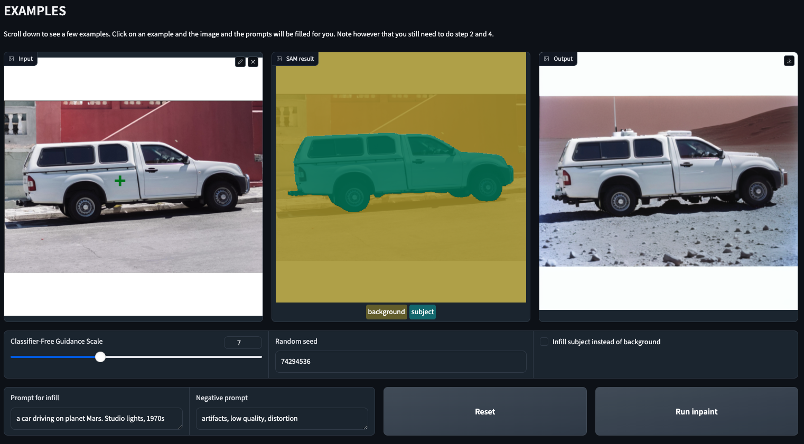
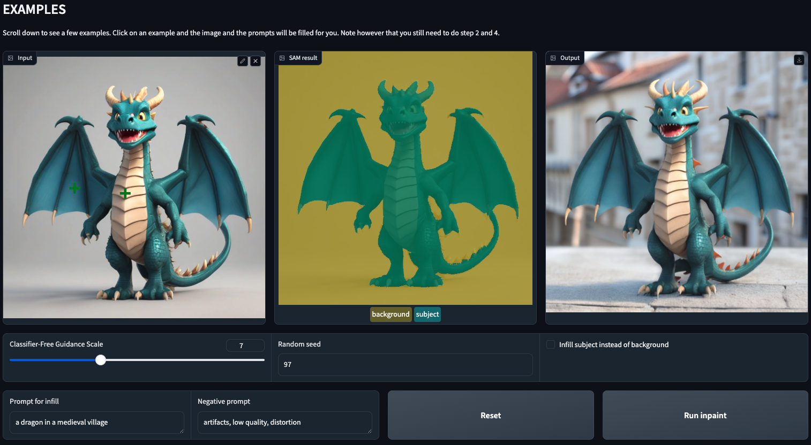
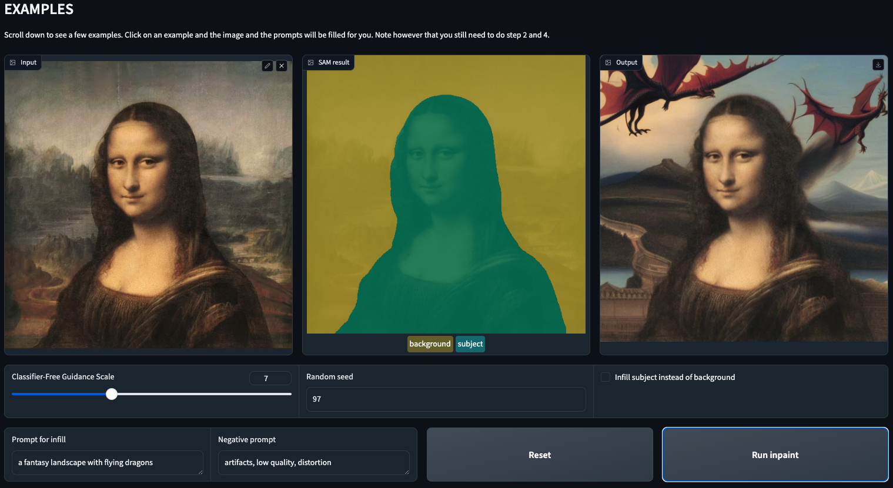

# Generative AI Inpainting Project
This project contains series of codes in a Jupyter notebook, incorporating [SAM](https://huggingface.co/docs/transformers/main/model_doc/sam) and [Huggingface's AutoPipeline](https://huggingface.co/docs/diffusers/v0.19.2/en/api/pipelines/auto_pipeline#diffusers.AutoPipelineForInpainting) to build a model that can segment an object in an image and generate an inpainting image to the non-segmented area of the image by using text prompt.

At the end of the notebook, a [Gradio](https://www.gradio.app/) app will pop up and display an interface to interact with the segmentation and the inpainting models.

## Generated Image Examples

© 2024 Wisnu Mulya
